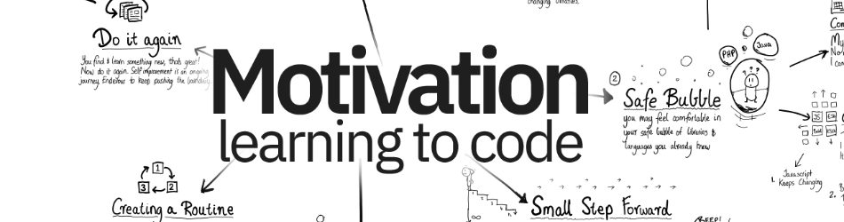

# Welcome to My GitHub Profile! 🚀

Hey there! Welcome to a realm where IT expertise meets innovation! I'm a frontend developer with mastery in React.js, TypeScript, SharePoint SPFx, and a suite of cutting-edge technologies. I architect seamless, user-centric web applications that redefine excellence. 

## About Me

With a passion for continuous learning, I ensure I'm at the forefront of tech trends. Leveraging SharePoint for optimized solutions is my forte. Let's collaborate on projects that demand innovation and efficiency, transforming challenges into opportunities for success. Explore my portfolio and let's embark on a journey of groundbreaking solutions together!

## Technologies I Work With

- C Language 
- SharePoint 
- TypeScript 
- Express 
- NodeJS 
- Postman 
- HTML 
- CSS 
- Bootstrap 
- Redux 
- Sass 
- Javascript 
- Tailwind CSS 
- React 
- MySQL 
- Mongo DB 
- Heroku 
- Azure 
- Git 
- Docker 
- Firebase 
- Bash 
- VS Code 

Feel free to reach out to me for any collaborations or projects! Let's build something amazing together. 😊
